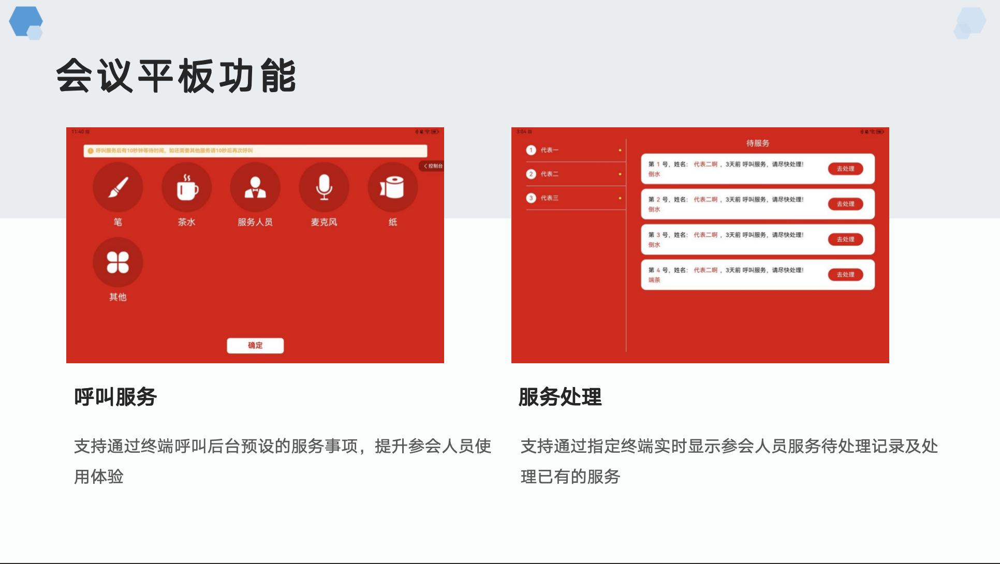

# 无纸化阅文表决系统

#### 介绍
无纸化阅文表决系统， **单次表决、批次表决、满意度测评、人事任免、无纸化阅文、阅文批注、统一控制、会议投屏、会议平板MDM** ，旨在提供高效、环保的电子阅读与投票解决方案，支持多设备同步及实时数据更新。系统已落地稳定运行多个商用项目。

### 支持功能

| 会议签到功能   |   
|--------|
| 统一签到   |
| 单次签到   |
| 重复签到   |
| 表决前签到  |
| 签到过程展示 |
| 补到     |
| 销到     |
| 签到通知   |

| 会议表决功能   |
|--------|
| 单次表决   |
| 批次表决   |
| 满意度测评   |
| 批次满意度测评  |
| 人事任免 |
| 批次人事任免     |
| 满意度评分     |
| 无记名投票     |
| 实名投票     |
| 满意度评分     |
| 表决过程展示   |
| 表决通知   |

| 阅文   |
|--------|
| 会议文件统一下发   |
| 会议文件权限控制   |
| 手写批注   |
| 统一控制打开阅文  |
| 阅文批注收集 |
| 离线阅文     |
| 协同阅文  |

| 其他功能   |
|--------|
| 电子桌牌   |
| 座位编排   |
| 会议室投屏   |
| 自定义拖拽投屏   |
| 参会人员设置  |
| 会议平板登记 |
| 平板控制     |
| PC控制     |
| 平板电量收集     |
| 平板统一关机     |
| 平板设备管控     |
| 会议服务     |
| 会议多媒体播放     |
| 会议主题设置     |
| 不同尺寸屏幕适配    |
| 会议报告导出    |
| 会议资料导出    |
| 会议指令监控   |
| 会议指令重发   |
| 平板设备心跳监测  |
| 会议流程编排  |
| 小组讨论  |

 

#### 软件架构

-  **前端：** Node.js，pnpm，Vue3.0+TypeScript
-  **后端：** Spring Boot 2.7.18、Maven、Redis、支持mysql和国产化数据库、Netty
-  **移动端：** uniapp、华为平板设备MDM、安卓打包

### 联系添加微信，备注：无纸化表决

#### 项目截图

#### 已商用案例

***人大常委会
***人大常委会
***人大常委会
***人大常委会
***人大常委会
***智慧政协
***智慧人大
***智慧集团